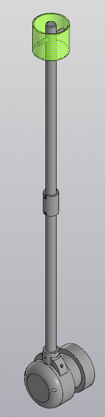

# 🚩 Mobile Robot Flag System (Yandex Rover Modification)

  

## 📌 Overview
This project is a modular folding mount for the flag on the Yandex rover.   
The flag is designed to be visible from all sides thanks to its cylindrical retroreflective surface, which takes into account the physiological characteristics of information perception.   
The design includes a vibration damper (compensator) and a protection against unscrewing (a retaining ring).

**Status:** ✅ Concept proof — tested for vibrations, ⚠️ limited wind resistance

The system is optimized for:

* 3D printing (FDM)
* Easy transportation
* Vibration resistance

---

## 🧩 Assembly Structure

The system consists of 5 main components:

* **Hub** – main mounting unit connected to the robot корпус
* **Retaining Ring** – prevents self-unscrewing under vibration
* **Adapter1** – threaded connection to Hub
* **Compensator** – vibration damping element
* **Adapter2** – supports reflective flag panel

---

## ⚙️ Key Features

* Modular design
* Foldable construction for transport
* Cylindrical reflective flag for 360° visibility
* Anti-loosening mechanism (Retaining Ring)
* Vibration compensation system

---

## 🧪 Engineering Notes

### Material

All parts are manufactured using **PETG**:

* good impact resistance
* suitable for outdoor use
* better than PLA for dynamic loads

---

### ⚠️ Limitations

* PETG threads may degrade over time
* System resonance occurs at **~14–20 Hz**
* Compensator effectiveness depends on real damping properties
* Wind speed up to **7 m/s** ✅
* Wind speed (survival) up to 9 m/s (risk of fracture) ⚠️
> 📊 Full calculations: [docs/calculations.md](docs/calculations.md)
---

## 📊 Performance Analysis

| Parameter         | Result      |
| ----------------- | ----------- |
| Natural Frequency | ~18–22 Hz   |
| Wind Load         | ~1.5 N      |
| Bending Moment    | ~0.6–0.9 Nm |
| Safety Factor     | >10         |

---

## 🔧 Recommendations

* Use threaded inserts for durability
* Add rubber/TPU layer in compensator
* Apply thread locker if needed
* Avoid operation in resonance conditions

---

## 🔧 Assembly

1. Attach the **bush** to the rover using 3 M6 bolts (use large washers)
2. Screw the **adapter 1** into the bush (M20×2.5 thread)
3. Attach the **retaining ring** to adapter 1 and secure it with 3 M3 screws (2 into the bush, 1 into adapter 1)
4. Put **adapter 2** in **adapter 1** and fix it with M3 bolts
4. Install the **compensator** between adapters 1 and 2
5. Fix **adapter 2** with 2 M3 screws
6. Wrap it with reflective tape
   
---

## 🚀 Future Improvements

* TPU-based damping system
* Metal pin inserts 
* Improved aerodynamics

---

## 👨‍💻 Author

Chebotarev Andrey
